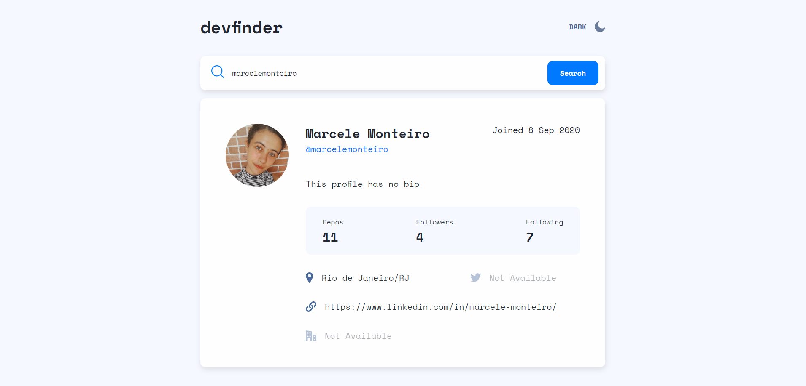

# Frontend Mentor Challenge: GitHub User Search App

Aplicação em React de busca de usuários do GitHub por username.

Projeto baseado em: https://www.frontendmentor.io/challenges/github-user-search-app-Q09YOgaH6

## Demonstração

Pelo GitHub Pages: https://marcelemonteiro.github.io/github-user-search-challenge

## Linguagens e ferramentas:

- **JavaScript**: React e React Router 
- **HTML**
- **CSS** 

## O que eu aprendi/pratiquei com esse projeto

- **CSS**: grid, flexbox e prefers-color-scheme media feature;
- **React router**: rotas dinâmicas e rotas aninhadas;
- **React**: componentes controlados;

## Screenshots

